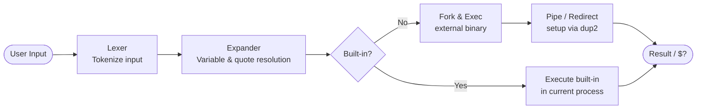

<div align="center">

```
                 _       _          _ _ 
  _ __ ___ (_)_ __ (_)___| |__   ___| | |
 | '_ ` _ \| | '_ \| / __| '_ \ / _ \ | |
 | | | | | | | | | | \__ \ | | |  __/ | |
 |_| |_| |_|_|_| |_|_|___/_| |_|\___|_|_|
```

**A minimal bash-like shell written in C**

[](https://en.wikipedia.org/wiki/C_(programming_language))
[](https://github.com/42School/norminette)
[](https://www.42network.org/)
[](LICENSE)

</div>

---

## Table of Contents

- [About](#about)
- [Features](#features)
- [Built-in Commands](#built-in-commands)
- [Architecture](#architecture)
- [Installation](#installation)
- [Usage](#usage)
- [Authors](#authors)

---

## About

**minishell** is a 42 School project that reimplements a subset of the `bash` shell from scratch in C. It demonstrates mastery of process management, file descriptors, signal handling, and POSIX system calls — all without relying on standard library shell utilities.

The shell supports an interactive REPL loop with readline history, full pipeline chaining, all standard I/O redirections, heredoc, and proper environment variable expansion with quote semantics.

---

## Features

| Feature | Syntax | Description |
|---|---|---|
| Pipes | `cmd1 \| cmd2` | Chain commands via inter-process pipes |
| Input redirection | `< file` | Read stdin from a file |
| Output redirection | `> file` | Write stdout to a file (overwrite) |
| Append redirection | `>> file` | Append stdout to a file |
| Heredoc | `<< DELIM` | Read inline input until delimiter |
| Variable expansion | `$VAR`, `$?` | Expand env vars and last exit code |
| Single quotes | `'...'` | Prevent all expansion |
| Double quotes | `"..."` | Allow variable expansion only |
| Signal handling | `Ctrl+C`, `Ctrl+D` | Proper SIGINT/EOF behavior |
| Command history | up/down arrows | Readline history integration |

---

## Built-in Commands

| Command | Description | Notable flags |
|---|---|---|
| `echo` | Print text to stdout | `-n` suppress newline |
| `cd` | Change working directory | Updates `PWD` / `OLDPWD` |
| `pwd` | Print current working directory | — |
| `export` | Set or display environment variables | — |
| `unset` | Remove environment variables | — |
| `env` | Print all environment variables | — |
| `exit` | Exit the shell | Optional exit code |

---

## Architecture

The shell processes each command through four sequential stages:



**Module overview:**

```
minishell/
├── main/        # Lexer, parser, expander, heredoc, signals (20 files)
├── builtins/    # echo, cd, pwd, export, unset, env, exit (16 files)
├── execute/     # Fork, exec, pipes, redirections (11 files)
└── include/     # minishell.h, builtins.h
```

---

## Installation

**Requirements:** `gcc`, `make`, `libreadline-dev`

```bash
# Clone the repository
git clone https://github.com/RossoRobot/minishell.git
cd minishell

# Build
make

# Clean up object files (optional)
make clean
```

---

## Usage

```bash
./minishell
```

<details>
<summary><strong>Example session</strong></summary>

```bash
minishell$ echo "Hello, World!"
Hello, World!

minishell$ export GREETING=hello
minishell$ echo "$GREETING from minishell"
hello from minishell

minishell$ ls | grep ".c" | wc -l
47

minishell$ cat << EOF
> line one
> line two
> EOF
line one
line two

minishell$ echo $?
0

minishell$ exit
```

</details>

<details>
<summary><strong>Pipe chaining example</strong></summary>

```bash
minishell$ cat /etc/passwd | grep root | cut -d: -f1
root

minishell$ ls -la | sort -k5 -n | tail -5
```

</details>

---

## Authors

<div align="center">

| Kevin Brauer | Matthias Volgger |
|:---:|:---:|
| [kbrauer@student.42.fr](mailto:kbrauer@student.42.fr) | [mvolgger@student.42.fr](mailto:mvolgger@student.42.fr) |
| 42 Vienna | 42 Vienna |

</div>

---

<div align="center">
<sub>Built at 42 School · 4,630 lines of C · 47 source files</sub>
</div>
